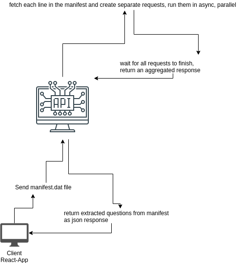

# Chegg task
Contains both client and server implementation.

# Implementation flow:
 - Create an endpoint that gets a binary file that contains resources in each file. Parse each of the 
 resources separately, however, in parallel in order to optimize the response time. Once all requests have been
 finished, return a response.
 - client has the option to load any manifest.dat file and get aggregated results in json format   
 


# Main libraries that i used:
 - server
    - Express js (https://expressjs.com)
    - multer for for handling multipart/form-data (https://github.com/expressjs/multer)
    - body-parser for parsing query string and post data easily (https://www.npmjs.com/package/body-parser)
    - node-fetch for creating requests (https://www.npmjs.com/package/node-fetch)
    - csvtojson for transforming csv response to json objects (https://www.npmjs.com/package/csvtojson)
    - google-cloud/vision for reading text in images (https://cloud.google.com/nodejs/docs/reference/vision/0.24.x/)
 - client
    - react js (https://reactjs.org/)
    - react-filepond for uploading files (https://github.com/pqina/react-filepond)
    - Material-UI (https://www.npmjs.com/package/@material-ui/core)


# setup
`docker-compose up` (localhost:3000)   
(for GOOGLE_APPLICATION_CREDENTIALS, create credentials.json in the root directory file for easy usage, it will be auto-copied to the docker and be used)


# Env variables
 - GOOGLE_APPLICATION_CREDENTIALS   
 path to google credentials file with permission to cloud-vision-api (https://cloud.google.com/vision/docs/quickstart-client-libraries)
 - NODE_ENV (production/development), will proxy accordingly
 
# run
`npm start`

# methods
## /api/extract_questions
Api that accepts a binary data and response with an aggregated response of extracted questions
 - verb: POST
 - form data:
    - name: manifest   
      value: type binary, manifest.dat file (each source in a new line). manifest.dat file provided as demo
 - response:
    - success:
        - status 200
        - body
         ```
         [ 
             {"source": "image", "value" : "question value" }, 
             {"source": "json", "value" : "question value" },
             {"source": "csv", "value" : "question value" }
         ]
         ```
    - error:
        - status 400
        - body
         ```
         { "error" : "string" }
         ```